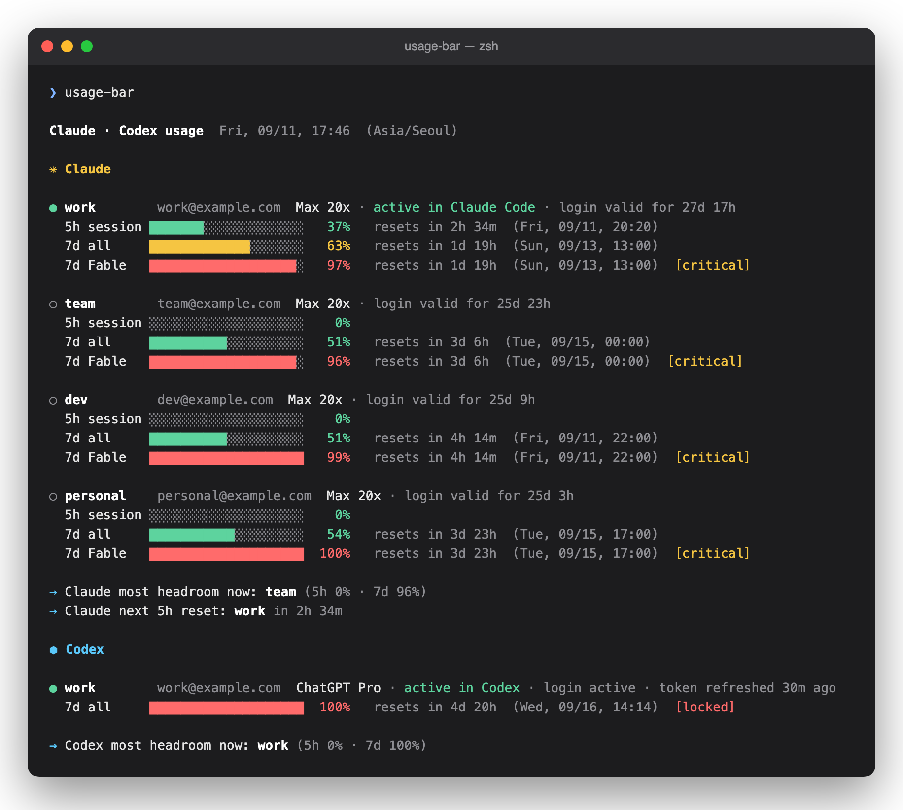
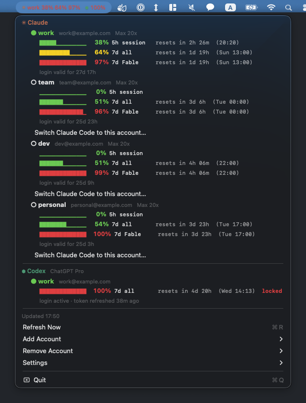

# Multi-Account Usage Bar

**Every Claude Max/Pro and ChatGPT (Codex) account's rate limits in one place** — session, weekly, per-model, and when each resets. A CLI and a macOS menu bar app, sharing one account store.

**100% local.** No server, no telemetry, no dependencies. Tokens stay on your machine and only go to Anthropic's and OpenAI's own endpoints — the same ones `/usage` and `/status` call.

<p align="center"></p>
<p align="center"></p>

## Why

Claude Code and Codex only show the account they are signed in as. This keeps its own login per account and shows all of them at once — `✳ Claude`, `⬢ Codex` — plus which one has the most headroom right now.

## Install

Node 18+.

```bash
npm install -g github:kjsik11/multi-account-usage-bar          # CLI → `usage-bar`
```

```bash
git clone https://github.com/kjsik11/multi-account-usage-bar.git   # macOS menu bar app
cd multi-account-usage-bar/menubar && make install                  # → /Applications, launches it
```

The app bundles the CLI, so it needs only Node. It lives in the menu bar only — no Dock icon, no window.

## Add accounts

```bash
usage-bar add                       # the account Claude Code is signed in as — no browser
usage-bar login --label personal    # any other account — opens Anthropic's sign-in
usage-bar add --codex               # the account Codex is signed in as
usage-bar login --codex             # another ChatGPT account
```

Use `add`, not `login`, for the account the CLI already uses — signing in twice can invalidate its token. For extra accounts, sign in from a private window. In the app: **Add Account**.

## Use

```bash
usage-bar                     # all accounts, all windows, reset times
usage-bar watch               # live view
usage-bar --json              # for scripts and status bars
usage-bar list                # accounts and login state
usage-bar switch work         # point Claude Code at another account, no /login
usage-bar switch codex:alt    # same for Codex
usage-bar whoami              # what Claude Code and Codex are signed in as
usage-bar remove work         # forget an account (deletes its tokens)
```

`--codex` (or `--provider codex`) makes any command act on Codex. `codex:` / `claude:` prefixes a name that exists for both.

Reading usage costs no quota. The endpoint throttles hard, so at most one request per account every 5 minutes, machine-wide — CLI, `watch` and the app share one cache.

## Notes

- **Storage:** macOS Keychain (service `multi-account-usage-bar`); Linux/Windows `~/.config/multi-account-usage-bar/tokens.json` (0600). Details in [SECURITY.md](SECURITY.md).
- **Login lifetime:** a Claude login lasts ~28 days (Anthropic's limit; refreshing doesn't extend it). Every view shows how long each has left.
- **Codex:** main 5h / 7d windows only. Browser login needs port 1455 or 1457 free; no `--manual`.
- **Unofficial.** Not affiliated with Anthropic or OpenAI; the endpoints are internal and may change. Anthropic's Consumer Terms (Feb 2026) say Pro/Max OAuth tokens may not be used in other tools — this only reads your own usage numbers, and a `--readonly` login can't run inference at all, but use it at your own discretion. `switch` rewrites the credential Claude Code or Codex holds; skip it if you only want to see your limits.

## License

MIT
